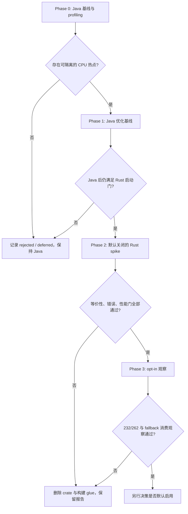

# Rust 性能路线图

> 当前状态是 **规划（planned）**，不是 Rust 已接入、已验证或已发布。Java 仍是插件唯一运行实现；
> 在 Phase 0 的性能证据和人工决策门通过以前，仓库不得增加 Cargo、Rust 源码、JNI 库或默认构建依赖。

## English summary

Rust is a benchmark-gated, optional future fast path for isolated CPU-bound work. It is not a rewrite plan and must not
own IntelliJ APIs, CVS protocol behavior, networking, cancellation, UI state, or workspace semantics. The Java path
remains authoritative and must stay available as a safe fallback on IDEA 232 through 262.

## 1. 为什么保留这条路线

本轮在大型 CVS 工作区观察到的主要瓶颈是：无边界目录递归、同步读取 Local History、刷新期间按文件
访问远端，以及 UI 更新粒度过细。这些问题首先应在 Java / IntelliJ 集成层修复，因为它们主要是
I/O、调度和边界错误，换成 Rust 不会自动变快。

Rust 只在后续 profiling 证明存在稳定、可隔离、CPU 占比足够高的纯计算热点时进入实验。当前可能的
候选只有：批量解析 `CVS/Entries` 等本地元数据、对已有字节缓存做批量校验或哈希、对大型状态快照做
无 IntelliJ 对象依赖的过滤。网络请求、VFS 遍历、Local History、UI 树更新和 CVS 命令执行不属于
Rust fast path。

## 2. Authority、边界与 non-goals

| 项目 | 约定 |
| --- | --- |
| 路线图 owner | 本文件；README 只链接，不复制完整决策 |
| 当前实现 owner | Java 插件代码、JavaCVS 和 IntelliJ Platform API |
| 决策权 | 维护者基于 Phase 0 报告显式批准或拒绝 |
| Rust 可拥有 | 输入/输出有界、确定性的纯计算 fast path |
| Rust 不拥有 | `VirtualFile`、`Project`、`ProgressIndicator`、UI、凭据、socket、CVS 协议与磁盘语义 |
| 默认路径 | Java；实验期 native 不可用、失败或不支持时自动回退 Java |

Non-goals：

- 不重写整个插件、JavaCVS、SSH 或 CVS 协议栈。
- 不用 Rust 解决网络延迟、服务器无响应、EDT 调度或错误状态收口。
- 不改变工作区 `CVS/` 管理目录格式、字符集、文件名或 revision 语义。
- 不使用 Panama FFM；插件仍须输出 Java 17 字节码并支持 IDEA 232。
- 不让最终用户安装 Rust toolchain，也不因 native 库缺失而阻止插件加载。
- 不因一次 microbenchmark 结果直接进入默认路径或扩大平台支持声明。

## 3. 分阶段决策

### Phase 0 — 无 Rust 的基线

用同一 fixture、同一 IDE/JBR、同一冷/热缓存定义基线。至少记录：

- 本地变更刷新 wall-clock、time-to-first-result、CPU time、allocation 与峰值内存。
- 扫描的 versioned / unversioned / ignored 文件和目录数。
- 刷新期间的远端 CVS 请求数；目标必须为 **0**。
- 取消延迟，以及网络不可达、慢响应和中途取消的最终状态。
- IDEA 2023.2.8（232）与 2026.2.1（262）的分别结果。

场景至少覆盖：小工作区、大工作区、未纳管生成目录中复制的 `CVS` 元数据、冷/热基线缓存、网络
可达/不可达/慢响应、正常修改/merge/二进制文件。原始客户文件不进入仓库；fixture 必须可公开或
脱敏重建。

### Phase 1 — 先赢得 Java 基线

先修复算法边界、重复 I/O、对象分配和批处理问题，再重新 profiling。只有 Java 优化后仍同时满足
以下条件，才能提出 Rust spike：

1. 候选纯计算热点占目标场景 CPU time 至少 **30%**，且不包含网络等待、VFS、Local History 或 UI。
2. 目标场景刷新 wall-clock 至少 **500 ms**，避免优化不可感知的小路径。
3. 预估 Rust 能使该热点 CPU time 至少下降 **30%**，或端到端 wall-clock 至少下降 **20%**。
4. 输入/输出合同可在不传递 IntelliJ 对象、不复制凭据和不改变 CVS 语义的情况下固定。

未同时达到即保持 `planned`、转为 `deferred/rejected`，不创建 crate。

### Phase 2 — 隔离 spike

通过独立 Task 和精确 write scope 才能创建候选目录（建议坐标 `native/cvs-fast-path/`）。实验约束：

- 默认构建仍为 Java-only；只在显式 Gradle property 下构建或加载 prototype。
- 边界优先使用很窄的 JNI `byte[] -> byte[]/primitive arrays` 合同；不把 Java 对象图传入 native。
- ABI 有显式版本握手；Rust panic 必须在 FFI 边界内捕获，禁止跨 JNI unwind。
- 对输入长度、记录数和输出大小设上限；超限、畸形输入或错误码立即回退 Java。
- Java 与 Rust 对同一 fixture 做差分测试；解析必须保留现有字符集与原始字节语义。
- 对 parser 类候选加入 malformed/property/fuzz corpus；corpus 不含客户代码或凭据。

### Phase 3 — opt-in 观察

只有 Phase 2 全部门通过，才可生成实验 native 包并由 feature flag 显式启用。采用前必须：

- IDEA 232 与 262 均完成安装、刷新、diff、history、update、commit 冒烟。
- native 库缺失、架构不匹配、`UnsatisfiedLinkError`、ABI 不匹配和内部错误均回退 Java。
- native fast path 不可发送网络请求、落盘、更新 UI 或改变取消/重试语义。
- 插件验证器没有新增兼容性错误；Java 17 classfile 和动态加载保持成立。
- 发布物对未打包 OS/arch 仍可正常加载插件并走 Java 路径。

是否默认启用是 Phase 3 之后的另一项显式决策，不能由 benchmark 自动推进。

## 4. 错误、恢复与重放

| 场景 | 预期结果 |
| --- | --- |
| native 缺失或不支持当前 OS/arch | 一次诊断日志；当前调用和后续调用走 Java，不弹循环错误 |
| ABI/version 不匹配 | 禁用本次进程的 fast path；Java fallback；不尝试加载未知 ABI |
| malformed / 超限输入 | 返回结构化错误并用 Java 重算；不得产生部分状态 |
| Rust panic | 在 FFI 内捕获并熔断 fast path；禁止 unwind 跨边界 |
| 调用期间取消 | 使用有界 chunk，在 chunk 间检查取消；取消结果仍由 Java/IDEA owner 签发 |
| IDE 重启 | feature flag 可重放；不保存 native 私有任务状态或第二份索引 authority |
| 性能回退 | 关闭 flag 即恢复 Java；删除 native artifact 不影响工作区或 CVS 数据 |

fast path 必须是无副作用的纯函数，因此失败不需要补偿事务；重试和 replay 对相同输入必须幂等。

## 5. 构建、依赖与分发门

- Gradle 仍是插件组装 owner。实验 Rust 构建只能作为显式 opt-in task，不能让现有
  `compileJava` / `buildPlugin` 在没有 Rust toolchain 时失败。
- Cargo dependency 必须锁定版本并检查许可证；不得引入 GPL/AGPL 或与 Apache-2.0 分发冲突的
  依赖。标准 Java-only 构建不隐式联网下载 Rust toolchain。
- native artifact 必须标记 target triple 和 ABI version，不能用一个文件名覆盖不同架构。
- 不把符号、临时 target、Cargo cache 或本机绝对路径打进 Git/zip。
- 若未来维护成本、平台矩阵或包体积超过可测收益，优先删除 Rust slice，保留 Java 实现。

## 6. 验收矩阵

| Gate | 必须证据 | 未通过结果 |
| --- | --- | --- |
| Hotspot | profiler 显示纯计算热点 ≥30% CPU | 不创建 Rust 实现 |
| Java first | Java 优化后的重复基线 | 保持 Java / 重新定位问题 |
| Equivalence | Java/Rust fixture 差分为 0 | 删除或修正 spike，不进入 opt-in |
| Error/fallback | 缺库、错 ABI、panic、畸形、取消均验证 Java fallback | fast path 不可发布 |
| Performance | 热点 CPU -30% 或端到端 -20%，且内存/包体积在报告中可接受 | `rejected/deferred` |
| Compatibility | IU-232、IU-262 verifier + 实机核心路径 | 不改变 Active 支持声明 |
| Consumer observation | 至少一次维护者在真实大工作区 opt-in 使用并回传指标 | 保持 experiment，不默认启用 |

内部 benchmark 或 validator 通过只证明对应范围，不表示插件已发布、全部平台已支持或 Rust 已成为
默认实现。

## 7. 当前恢复/删除条件

当前只允许本文件、README 入口和 planning guard。`roadmap_status: planned` 时，
`scripts/check_rust_roadmap.py` 会拒绝 Cargo manifest、`.rs` 源码或 Rust Gradle wiring。

后续若显式批准 Phase 2，必须在同一受控变更中把状态改为 `experiment`、记录 Task/基准 locator，
并增加真正的等价性和 fallback tests。若实验被拒绝或退役，则删除 crate、native binaries、Gradle
glue 和 feature flag，状态改为 `rejected` 或 `retired`；Java 路径与 benchmark 报告保留。

当前 consumer observation 仅为 README 可发现该路线；真实性能收益、native packaging 与运行期
fallback 均为 **unknown**，等待 Phase 0/2 的新证据。
